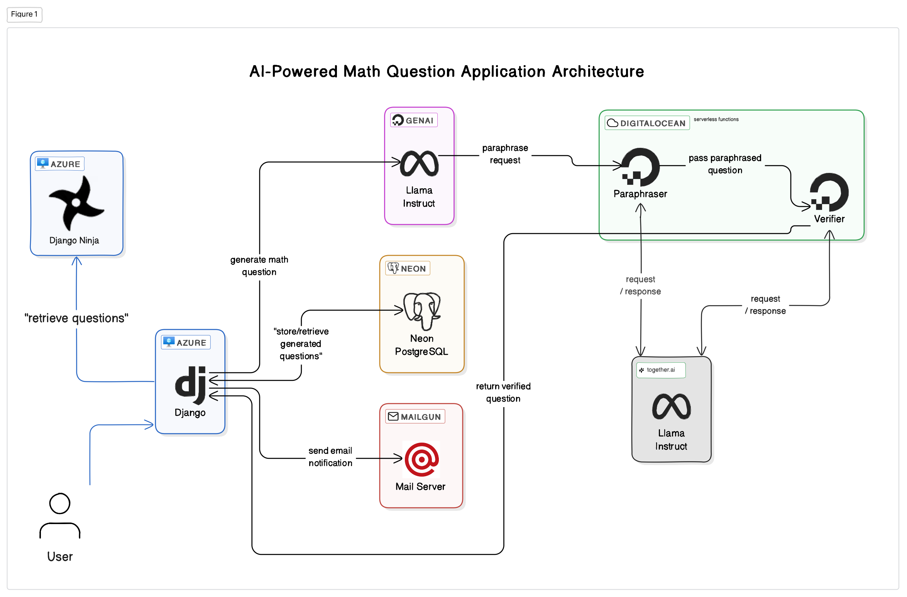
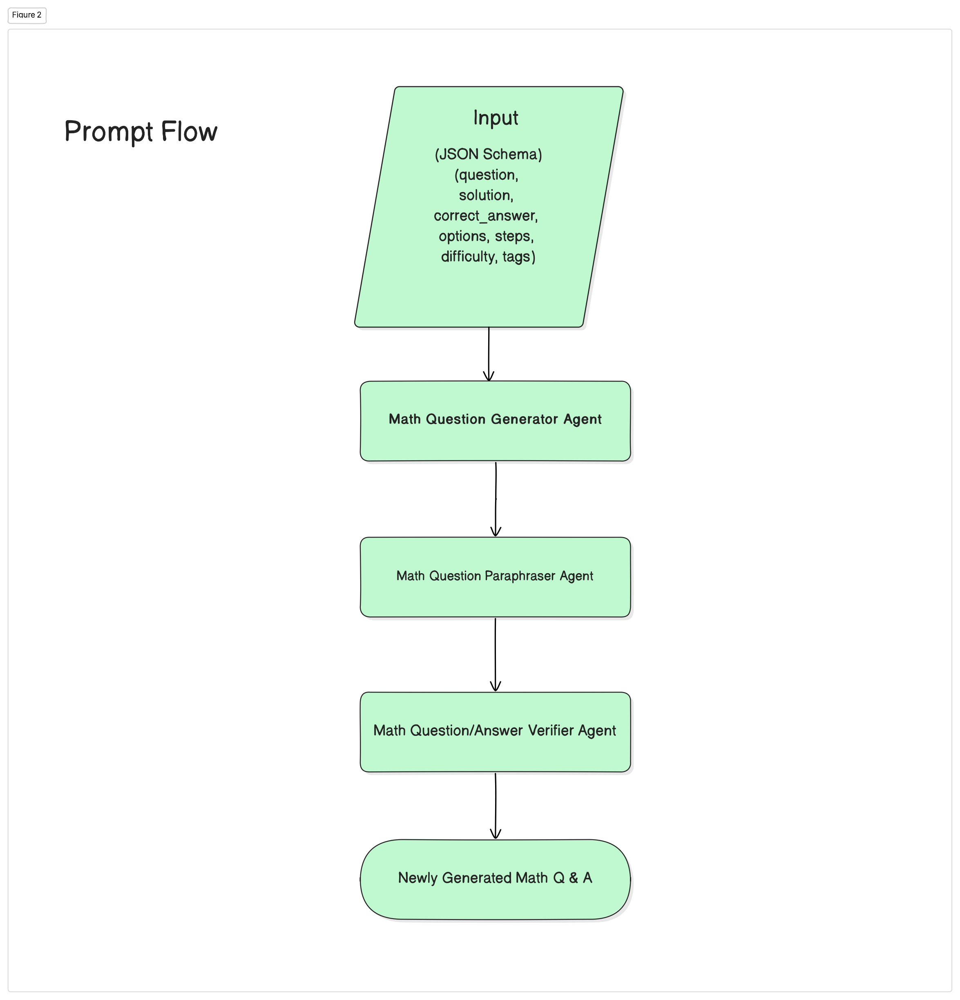
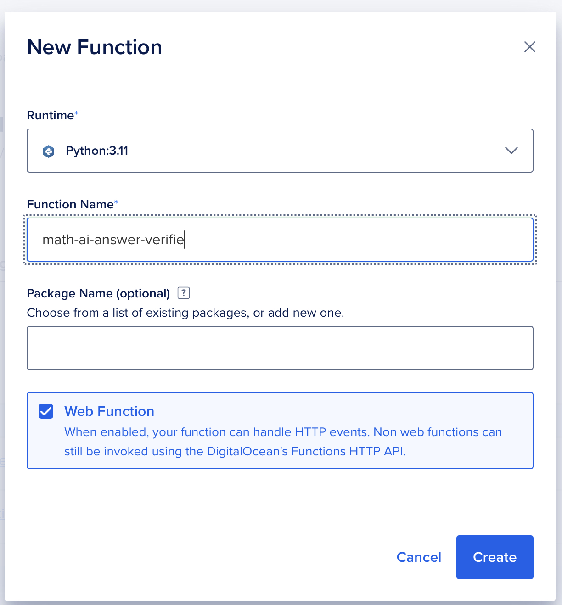
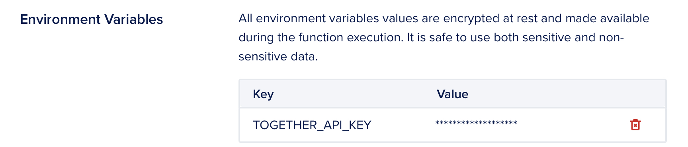
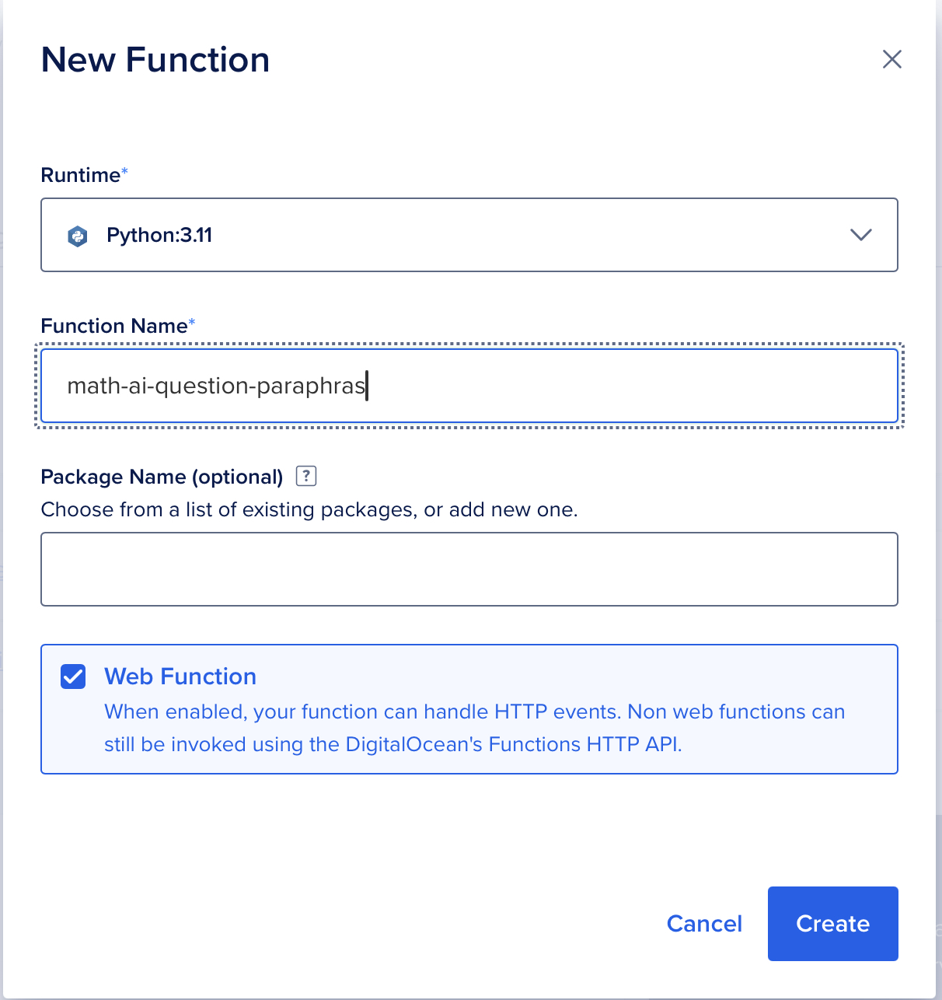

# Math Quizzty

Math Question and Answer with AI-Generator Question

[](https://github.com/cookiecutter/cookiecutter-django/)
[](https://github.com/astral-sh/ruff)

License: MIT

## How to Run

### **Prerequisite**

- Docker, if you don't have it yet, follow the [installation instructions](https://docs.docker.com/get-started/get-docker/#supported-platforms);

### Running Locally with Docker

1. Open your terminal and clone this repo

    ```sh
    % git clone https://github.com/jericho1050/math_quizzty.git
    ```

2. Change to cloned directory, configure the env variables

   ```bash
   % cd math_quizzty 
   ```

3. Open up your `/math_quizzty/.envs/.local/.django` and you must have these environment variables

    ```ini
    # General
    # ------------------------------------------------------------------------------
    USE_DOCKER=yes
    IPYTHONDIR=/app/.ipython

    # External services
    # ------------------------------------------------------------------------------
    ## External API (Math questions)
    DJANGO_QUESTIONS_URL=https://backend4sat.site/api/v0

    ## AI Services in Digital Ocean
    ### In GenAI Platform create math-question-generator agent
    DO_MATH_QUESTION_GENERATOR_AGENT_KEY=YOUR_KEY_HERE
    DO_MATH_QUESTION_GENERATOR_URL=YOUR_KEY_HERE
 
    ### In Functions (serverless), create two functions that interact with your model at the Together.ai inference.
    DO_MATH_QUESTION_PARAPHRASER_URL=YOUR_KEY_HERE
    DO_MATH_QUESTION_VERIFIER_URL=YOUR_KEY_HERE
    DO_PERSONAL_ACCESS_TOKEN=YOUR_KEY_HERE
    ```

    Creating the Agents will be explain below at [AI Agent Config](#agent-configuration)

4. It might take a while, once finished building, run the containers

    ```bash
   % docker compose -f docker-compose.local.yml build
   ```

   ```bash
   % docker compose -f docker-compose.local.yml up
   ```

5. You can now visit `http://localhost:8000`

**Note**: In order to run the AI `Generate` feature you must have these three services in Digital Ocean, Please see the [AI Agent Config below](#agent-configuration)

<!-- markdownlint-disable MD033 -->
## Software Architecture

<details>
<summary style="font-size: 1.2em; font-weight: bold">View Figures</summary>



</details>

<h2 id="agent-configuration">AI Agent Config</h2>

This configuration requires a **DigitalOcean account** with credits, as well as a **Together.ai account** with credits, of course.

1. [Create the Math Question Generator Agent using Llama 3.3 Instruct (70B) on Digital Ocean's GenAI Platform](https://www.digitalocean.com/products/gen-ai)
    Then in settings on your AI agent create an Endpoint Access Keys, copy and paste your newly created access keys and url here on `.django`

    

    ```ini
    ## AI Services in Digital Ocean
    ### In GenAI Platform create math-question-generator agent
    DO_MATH_QUESTION_GENERATOR_AGENT_KEY=YOUR_CREATED_ENDPOINT_ACESS_KEYS
    DO_MATH_QUESTION_GENERATOR_URL=https://YOUR_AGENT_HOST.ondigitalocean.app
    ```

    <details>
    <summary style="font-size: 1.7em; font-weight: bold">
    Give Your Agent Instructions
    </summary>

    ```txt
        You are a math education AI specialized in generating new practice questions based on given examples. Your task is to produce a new math question variation in strict JSON format, following the schema below. Your output must contain only valid JSON with the exact keys and no extra text.

        **Instructions:**
        1. Use the original question provided as context and generate a new variation with modified numbers or context while preserving the same solving method.
        2. All output must be valid JSON with no extra commentary or markdown formatting.
        3. Ensure the "Tags" objects are correctly formatted (e.g., {"name": "algebra", "slug": "algebra"}).
        4. Follow the schema exactly.

        **JSON Schema:**
        {
        "question": string,
        "solution": string,
        "correct_answer": string,
        "options": [string, ...],
        "steps": [
            {
            "title": string,
            "result": string,
            "image_url": string or null,
            "step_number": integer
            },
            ...
        ],
        "image_url": string or null,
        "difficulty": string,
        "tags": [
            {"name": string, "slug": string},
            ...
        ]
        }

        EXAMPLES:

        ###
        Example 1:

        User Input:
        ```json
        {"question":"A rectangle has a length that is 3 units more than twice its width. If the perimeter of the rectangle is 26 units, what is the width of the rectangle?","solution":"<span style=\"color: green\">Choice B is correct.</span><br><strong>Let\"s solve this step by step:</strong><br>1. Let w = width<br>2. Length = 2w + 3<br>3. Perimeter formula: 2(l + w) = 26<br>4. 2(2w + 3 + w) = 26<br>5. 2(3w + 3) = 26<br>6. 6w + 6 = 26<br>7. 6w = 20<br>8. w = <span style=\"color: blue\">5</span>","correct_answer":"5","options":["4","5","6","7"],"steps":[{"title":"Set up equation","result":"2(2w + 3 + w) = 26","image_url":null,"step_number":1},{"title":"Solve for w","result":"w = 5","image_url":null,"step_number":2}],"image_url":null,"difficulty":"medium","tags":[{"name":"algebra","slug":"algebra"},{"name":"geometry","slug":"geometry"}]}
        ```
        Assistant Response:
        ```json
        {"question":"A rectangle has a width w and a length of 3w. If the perimeter is 48, what is the width?","solution":"Let w be the width. Then the length is 3w. The perimeter is 2*(w + 3w) = 8w, so 8w = 48 and w = 6.","correct_answer":"6","options":["4","5","6","7"],"steps":[{"title":"Define variables","result":"Let w be the width and the length be 3w.","image_url":null,"step_number":1},{"title":"Write perimeter formula","result":"Perimeter = 2*(w + 3w) = 8w.","image_url":null,"step_number":2},{"title":"Solve for w","result":"8w = 48, hence w = 6.","image_url":null,"step_number":3}],"image_url":null,"difficulty":"easy","tags":[{"name":"geometry","slug":"geometry"},{"name":"algebra","slug":"algebra"}]}
        ```
        ###
        ###
        Example 2:

        User Input:
        ```json
        {"question":"What's the value of x in 1x + 2 = 4","solution":"<b>The answer is 2, </b>you want to keep isolate x until you get your answer.","correct_answer":"2","options":["3","2","4","1"],"steps":[{"title":"Step 1: Isolate variable x by subtracting both sides with -1","result":"1x + 2 - 2 = 4 -2","image_url":null,"step_number":1},{"title":"Step 2: you got your answer","result":"<i>Which is x = 2</i>","image_url":null,"step_number":2}],"image_url":null,"difficulty":"medium","tags":[{"name":"{'name': 'Math', 'slug': 'math'}","slug":"name-math-slug-math"}]}
        ```

        Assistant Response:

        ```json
        {   "question": "What is the value of x in the equation x + 2 = 4?",   "solution": "Subtract 2 from both sides of the equation: x = 4 - 2, so x = 2.",   "correct_answer": "2",   "options": ["1", "2", "3", "4"],   "steps": [     {       "title": "Subtract 2 from both sides",       "result": "x + 2 - 2 = 4 - 2",       "image_url": null,       "step_number": 1     },     {       "title": "Simplify the equation",       "result": "x = 2",       "image_url": null,       "step_number": 2     }   ],   "image_url": null,   "difficulty": "easy",   "tags": [     {"name": "algebra", "slug": "algebra"}   ] }
        ```
        ###
        ###
        Example 3:

        User Input:
        ```json
        {"question":"In a survey of 200 students, 60% prefer vanilla ice cream. How many students prefer vanilla ice cream?","solution":"<span style=\"color: green\">Choice A is correct.</span><br><strong>To solve:</strong><br>1. Convert 60% to decimal: 60% = 0.60<br>2. Multiply: 200 × 0.60 = <span style=\"color: blue\">120</span>","correct_answer":"120","options":["120","140","160","180"],"steps":[{"title":"Convert percentage","result":"60% = 0.60","image_url":null,"step_number":1},{"title":"Calculate total","result":"200 × 0.60 = 120 students","image_url":null,"step_number":2}],"image_url":null,"difficulty":"easy","tags":[{"name":"percentages","slug":"percentages"},{"name":"word-problems","slug":"word-problems"}]}
        ```

        Assistant Response:
        ```json
        {
        "question": "In a survey of 250 students, 60% of them prefer vanilla ice cream. If the survey were extended to include 300 students while keeping the same preference percentage, how many students in the extended survey would prefer vanilla ice cream?",
        "solution": "First, convert 60% to its decimal form: 0.60. Then, multiply 0.60 by the new total of 300 students. 0.60 × 300 = 180. Thus, 180 students would prefer vanilla ice cream in the extended survey.",
        "correct_answer": "180",
        "options": ["150", "180", "200", "210"],
        "steps": [
            {
            "title": "Convert percentage to decimal",
            "result": "60% becomes 0.60.",
            "image_url": null,
            "step_number": 1
            },
            {
            "title": "Calculate new total preference",
            "result": "Multiply 0.60 by 300 to get 180.",
            "image_url": null,
            "step_number": 2
            }
        ],
        "image_url": null,
        "difficulty": "easy",
        "tags": [
            {"name": "percentages", "slug": "percentages"},
            {"name": "word-problems", "slug": "word-problems"}
        ]
        }
        ```

        Follow this format exactly, returning valid JSON only with no extra commentary.
    ```

2. [Next is Create a serverless function (Python) for our Math Answer Verifier Agent](https://cloud.digitalocean.com/functions)
    

    Note: you need to get your Together.ai user key at <https://api.together.ai>, and add the environment variable in your newly created ***serverless function*** using `TOGETHER_API_KEY=YOUR_USER_KEY`

    

    Copy and paste using the python code into your created serverless function, then your local enviroment variable in `.django` file

    ```ini
    DO_MATH_QUESTION_VERIFIER_URL=YOUR_MATH_QUESTION_VERIFIER_URL_HERE
    ```

    <details>
    <summary style="font-size: 1.7em; font-weight: bold">Paste this Python code into your function</summary>

    ```py
    import os
    import json
    import requests

    def main(event, context):
        together_api_key = os.environ.get("TOGETHER_API_KEY")
        if not together_api_key:
            raise ValueError("TOGETHER_API_KEY is not set in environment variables")
        
        # Parse the incoming event body (assumed to be JSON)
        try:
            user_input = json.loads(event.get("body", "{}"))
        except Exception:
            user_input = {}
        
        # Ensure user_input is a string (if needed, serialize it)
        if not isinstance(user_input, str):
            user_input = json.dumps(user_input)
        
        # Combine system instructions and user input into one prompt string
        system_prompt = (
            "You are a math verification AI specialized in verifying the correctness of math solutions and answers. "
            "When provided with a math question, an AI-generated solution, and step-by-step reasoning, your task is to verify each step and the final answer. "
            "Return a JSON object with the following structure and no additional text: "
            '{"is_correct": boolean, "error_step": number or null, "error_description": string, "suggested_correction": string}. '
            "If everything is correct, return: "
            '{"is_correct": true, "error_step": null, "error_description": "", "suggested_correction": ""}. '
            "If there is an error, indicate the first step where the error occurs.\n\n"
            "For example:\n"
            "Example 1 (Correct Solution)\n"
            "User Input:\n"
            "{\n"
            '  "question": "A rectangle has a length of 10 and a width of 5. What is the area?",\n'
            '  "solution": "To compute the area, multiply length × width: 10 × 5 = 50.",\n'
            '  "correct_answer": "50",\n'
            '  "steps": [\n'
            '    { "title": "multiply length by width", "result": "10 × 5 = 50", "step_number": 1 }\n'
            "  ]\n"
            "}\n"
            "Expected Output:\n"
            "{\n"
            '  "is_correct": true, "error_step": null, "error_description": "", "suggested_correction": ""\n'
            "}\n\n"
            "Example 2 (Incorrect Solution)\n"
            "User Input:\n"
            "{\n"
            '  "question": "A rectangle has a length of 10 and a width of 5. What is the area?",\n'
            '  "solution": "To compute the area, multiply length × width: 10 × 5 = 45.",\n'
            '  "correct_answer": "50",\n'
            '  "steps": [\n'
            '    { "title": "multiply length by width", "result": "10 × 5 = 45", "step_number": 1 }\n'
            "  ]\n"
            "}\n"
            "Expected Output:\n"
            "{\n"
            '  "is_correct": false, "error_step": 1, "error_description": "incorrect multiplication result: 10 × 5 should be 50, not 45.", "suggested_correction": "correct step 1 to 10 × 5 = 50."\n'
            "}\n"
        ) + user_input

        # Prepare payload for the Together API
        payload = {
            "model": "meta-llama/Llama-3.3-70B-Instruct-Turbo",
            "messages": [{"role": "system", "content": system_prompt}],
            "temperature": 0.1,
            "top_p": 0.9,
            "max_tokens": 500,
            "stream": False,
        }

        headers = {
            "Authorization": f"Bearer {together_api_key}",
            "Content-Type": "application/json",
        }

        api_url = "https://api.together.xyz/v1/chat/completions"

        try:
            response = requests.post(api_url, headers=headers, json=payload, timeout=20)
            response.raise_for_status()
            result = response.json()["choices"][0]["message"]["content"]
            try:
                json_result = json.loads(result)
            except json.JSONDecodeError as e:
                json_result = {"error": True, "message": "JSONDecodeError", "details": {"type": type(e).__name__, "api_url": api_url}}
            
            return {
                "body": json.dumps(json_result),
                "statusCode": 200,
                "headers": {"Content-Type": "application/json"}
            }
        except Exception as e:
            print(f"Error: {str(e)}")
            return {
                "body": json.dumps({
                    "error": True,
                    "message": str(e),
                    "details": {"type": type(e).__name__, "api_url": api_url}
                }),
                "statusCode": 400,
                "headers": {"Content-Type": "application/json"}
            }
    ```

    </details>

3. [Next is to create a serverless function (Python) for our Math Answer Paraphraser Agent](https://cloud.digitalocean.com/functions)
    

    Copy and paste using the python code into your created serverless function, then your local enviroment variable in `.django` file

   


    ```ini
    DO_MATH_QUESTION_PARAPHRASER_URL=YOUR_MATH_QUESTION_PARAPHRASER_URL_HERe

    ```

    <details>
    <summary style="font-size: 1.7em; font-weight: bold">Paste this Python code into your function</summary>

    ```py
    import os
    import json
    import requests

    def main(event, context):
        together_api_key = os.environ.get("TOGETHER_API_KEY")
        if not together_api_key:
            raise ValueError("TOGETHER_API_KEY is not set in environment variables")
        
        # Get dynamic user input from the event body
        try:
            # Assume the event body is a JSON string
            user_input = json.loads(event.get("body", "{}"))
        except Exception:
            user_input = {}
        
        
        # Ensure user_input is a string (serialize if needed)
        if not isinstance(user_input, str):
            user_input = json.dumps(user_input)
        
        system_prompt = (
            "You are a math paraphraser AI. Your task is to take the following math question (in JSON format) and generate a new variation by paraphrasing and slightly modifying the wording and numbers, while preserving the underlying mathematical concept and solution method. "
            "Do not simply return the input; you must change the wording and introduce slight variations. "
            "Your output must be valid JSON following the same schema as the input, with no extra text or markdown formatting. "
            "Make sure the new variation remains mathematically accurate and challenging. "
            "Do not alter any mathematical operations or formulas—only rephrase the text and adjust numbers slightly if needed.\n\n"
        ) + user_input

        
        payload = {
            "model": "meta-llama/Llama-3.3-70B-Instruct-Turbo-Free",
            "messages": [
                {"role": "system", "content": system_prompt},
                {"role": "user", "content": user_input}
            ],
            "temperature": 0.69,
            "top_p": 0.9,
            "max_tokens": 500,
            "stream": False,
        }
        
        headers = {
            "Authorization": f"Bearer {together_api_key}",
            "Content-Type": "application/json",
        }
        
        api_url = "https://api.together.xyz/v1/chat/completions"
        
        try:
            response = requests.post(api_url, headers=headers, json=payload, timeout=20)
            response.raise_for_status()
            result = response.json()["choices"][0]["message"]["content"]
            
            try:
                json_result = json.loads(result)
            except json.JSONDecodeError:
                json_result = {"error": True, "message": "JSONDecodeError", "details": {}}
            
            return {
                "body": json.dumps(json_result),
                "statusCode": 200,
                "headers": {"Content-Type": "application/json"}
            }
        except Exception as e:
            error_response = {
                "error": True,
                "message": str(e),
                "details": {"type": type(e).__name__, "url": api_url}
            }
            return {
                "body": json.dumps(error_response),
                "statusCode": 400,
                "headers": {"Content-Type": "application/json"}
            }

    ```

    </details>

4. Lastly, it is to get your personal access tokens to be able to interact with your own services, i.e., the serverless functions. Then paste it here in your .django

    ```ini
    DO_PERSONAL_ACCESS_TOKEN=YOUR_PERSONAL_ACCESS_TOKEN HERE
    ```


## Basic Commands

### Setting Up Your Users

- To create a **normal user account**, just go to Sign Up and fill out the form. Once you submit it, you'll see a "Verify Your E-mail Address" page. Go to your console to see a simulated email verification message. Copy the link into your browser. Now the user's email should be verified and ready to go.

- To create a **superuser account**, use this command:

      python manage.py createsuperuser

For convenience, you can keep your normal user logged in on Chrome and your superuser logged in on Firefox (or similar), so that you can see how the site behaves for both kinds of users.

### Type checks

Running type checks with mypy:

    mypy math_quizzty

### Test coverage

To run the tests, check your test coverage, and generate an HTML coverage report:

    coverage run -m pytest
    coverage html
    open htmlcov/index.html

#### Running tests with pytest

    pytest

## Deployment

The following details how to deploy this application.

TODO

### Docker

See detailed [cookiecutter-django Docker documentation](https://cookiecutter-django.readthedocs.io/en/latest/3-deployment/deployment-with-docker.html).
